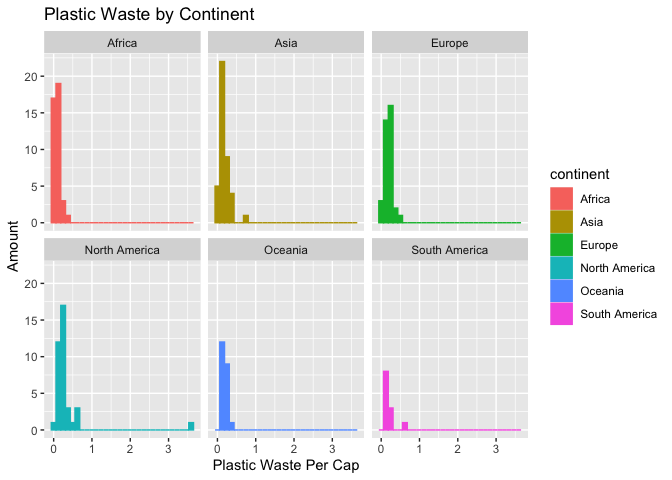
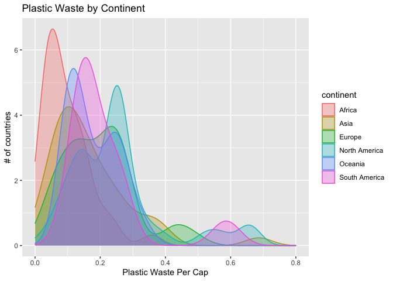
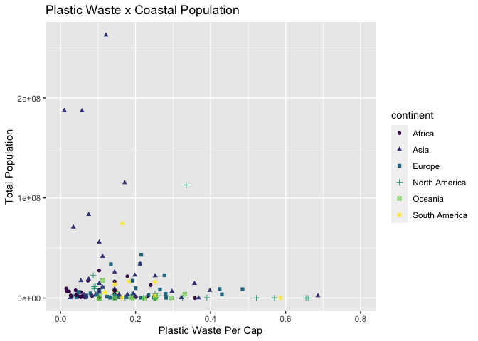

Lab 02 - Plastic waste
================
Marcus Minko
01-20-2022

## Load packages and data

``` r
library(tidyverse) 
```

``` r
plastic_waste <- read.csv("data/plastic-waste.csv")
```

## Exercises

### Exercise 1

You can’t tell much from this visual, besides the fact that Oceania and
South America have fewer countries registering waste per cap data.

``` r
ggplot(data = plastic_waste, mapping = aes(x = plastic_waste_per_cap, color = continent, fill = continent)) + geom_histogram() + facet_wrap(~ continent) + labs(x = "Plastic Waste Per Cap", y = "Amount", title = "Plastic Waste by Continent")
```

    ## `stat_bin()` using `bins = 30`. Pick better value with `binwidth`.

    ## Warning: Removed 51 rows containing non-finite values (stat_bin).

<!-- -->

### Exercise 2

``` r
ggplot(data = plastic_waste, 
       mapping = aes(x = plastic_waste_per_cap, 
                     color = continent, 
                     fill = continent)) + xlim(0, .8) +
  geom_density(alpha = 0.3) + labs(x = "Plastic Waste Per Cap", y = "# of countries", title = "Plastic Waste by Continent")
```

    ## Warning: Removed 52 rows containing non-finite values (stat_density).

<!-- -->

### Exercise 3

The color and fill features are a subordinate part of the mapping = aes
function, and alpha is subordinate or nested within the geom_density
function. These features can only be defined within their appropriate
respective functions.

### Exercise 4

With the violin plot, opposed to boxplots, we lose some specificity
regarding mean, quartiles, etc.

``` r
ggplot(data = plastic_waste,    mapping = aes(x = continent, y = plastic_waste_per_cap, color = continent, fill = continent)) + geom_violin() + labs(x = "Continent", y = "Plastic Waste Per Cap", title = "Plastic Waste by Continent") 
```

    ## Warning: Removed 51 rows containing non-finite values (stat_ydensity).

<!-- -->

### Exercise 5

Based on the scatterplot, there is not a clear relationship between the
two variables. Perhaps one could say that there is a tendency that they
are some what negatively correlated in that as waste per cap goes up,
mismanaged waste goes down.

``` r
ggplot(data = plastic_waste, mapping = aes(x = plastic_waste_per_cap, y = mismanaged_plastic_waste)) + geom_point() + labs(x = "Plastic Waste Per Cap", y = "Mismanaged Plastic Waste", title = "Plastic Waste x Mismanaged Plastic Waste")
```

    ## Warning: Removed 51 rows containing missing values (geom_point).

<!-- -->

### Exercise 6

It seems that Asia is the worst offender of waste mismanagement.

``` r
ggplot(data = plastic_waste, mapping = aes(x = plastic_waste_per_cap, y = mismanaged_plastic_waste, color = continent, shape = continent)) + geom_point() + scale_color_viridis_d() + labs(x = "Plastic Waste Per Cap", y = "# of countries", title = "Plastic Waste x Mismanaged Plastic Waste")
```

    ## Warning: Removed 51 rows containing missing values (geom_point).

<!-- -->

### Exercise 7

There does not appear to be a linear relationship in either case.

``` r
ggplot(data = plastic_waste, mapping = aes(x = plastic_waste_per_cap, y = total_pop, color = continent, shape = continent)) + geom_point() + scale_color_viridis_d() + labs(x = "Plastic Waste Per Cap", y = "Total Population", title = "Plastic Waste x Total Population")
```

    ## Warning: Removed 61 rows containing missing values (geom_point).

<!-- -->

``` r
ggplot(data = plastic_waste, mapping = aes(x = plastic_waste_per_cap, y = coastal_pop, color = continent, shape = continent)) + xlim(0, .8) + geom_point() + scale_color_viridis_d() + labs(x = "Plastic Waste Per Cap", y = "Total Population", title = "Plastic Waste x Coastal Population")
```

    ## Warning: Removed 52 rows containing missing values (geom_point).

<!-- -->

### Exercise 8

Remove this text, and add your answer for Exercise 8 here.

``` r
ggplot(data = plastic_waste)+
  geom_point(mapping = aes(x = coastal_pop/total_pop,
                     y =  plastic_waste_per_cap,
                     color = continent)) +
    geom_smooth(mapping = aes(x = coastal_pop/total_pop,
                              y = plastic_waste_per_cap))+
  ylim(0, 0.8) +
  labs(title = "Plastic waste x coastal/total pop.",
       x = "Coastal/total pop.)",
       y = "Plastic waste per capita",
       color = "Continent")
```

    ## `geom_smooth()` using method = 'loess' and formula 'y ~ x'

    ## Warning: Removed 62 rows containing non-finite values (stat_smooth).

    ## Warning: Removed 62 rows containing missing values (geom_point).

<!-- -->

## Pro-Tips

### Excercise 3

Try this :D

ggplot(data = plastic_waste, mapping = aes(x = continent, y =
plastic_waste_per_cap)) + geom_violin()+ geom_boxplot(width=.3,
fill=“green”) + stat_summary(fun.y=median, geom=“point”)

### Exercise 5

Helpful
reference:<http://www.sthda.com/english/wiki/ggplot2-themes-and-background-colors-the-3-elements>
